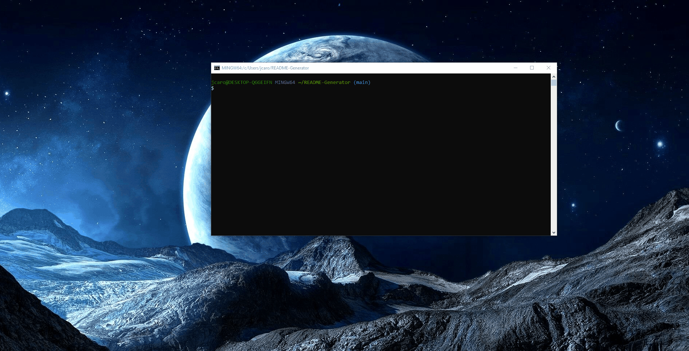

# ReadMeGenerator

## Description
This Project lets you create a ReadMe file for any of your projects. Its a simple and easier way to generate a ReadMe.md File also saving you a lot of time with your projects
## Table of Contents
[Installation](#Installation)

[Usage](#Usage)

[License](#License)

[Questions](#Questions)
## Installation
Need to have Package.json
## Usage
Simply answer all the questions and the program will automatically generate a readme file for your project
## License
This project is covered under the .
## Contact
If you have any additional questions, contact me by email or GitHub.

Email: Jcaro1993@gmail.com

GitHub: https://github.com/Jcaro1993

# Here is a simple video of how it works 
;

#Images of Readme
;
